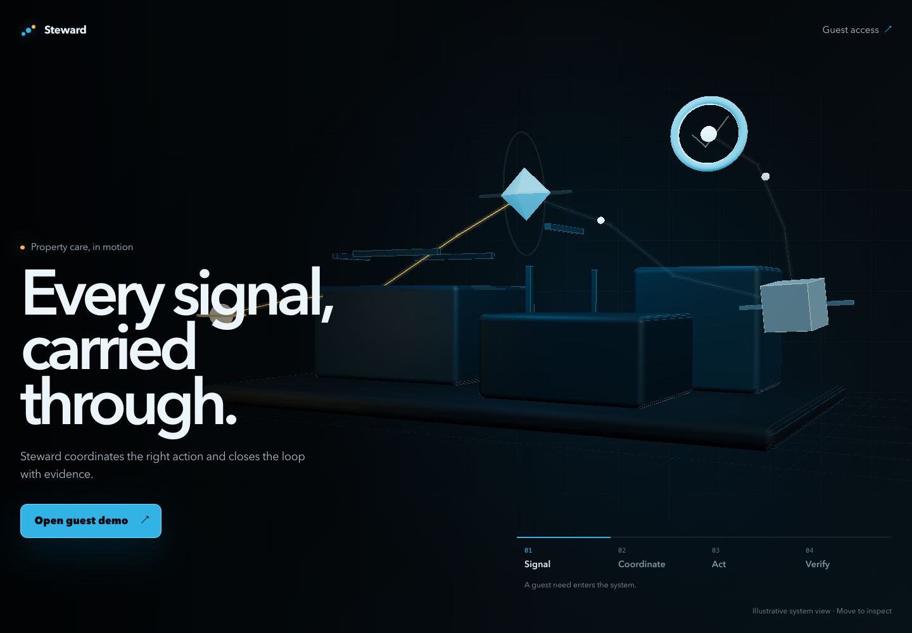

# Steward

Steward is an AI property manager for short-term rentals. It handles guest issues from the first call through a verified resolution, without requiring the owner to coordinate every step.

## The problem

A single guest issue can create hours of manual work. The owner has to understand the problem, search for instructions, contact vendors, compare quotes, share updates, and confirm the work was actually completed. Guests wait while context is passed between people, and owners are pulled into routine problems at any hour.

## What Steward does

Steward answers guests by voice, asks focused questions, and uses the property’s instructions, policies, vendors, and budget to decide what should happen next. It can:

- guide safe troubleshooting;
- request a camera view only when it would help;
- contact approved vendors and collect real quotes;
- keep guests and owners updated;
- act within the owner’s set budget; and
- close an incident only after the result is supported by evidence.

Steward does not report a repair, booking, payment, or resolution as complete until a real tool result or evidence confirms it.

## Why it matters

- **Guests get help faster:** one clear point of contact is available when an issue happens.
- **Owners do less coordination:** routine incidents can move forward without constant calls and messages.
- **Costs stay controlled:** property rules, preferred vendors, and spending limits guide every action.
- **Outcomes are accountable:** the timeline records decisions, calls, quotes, evidence, and final results.

## How it works

1. **Report:** A guest calls Steward or starts a browser voice session.
2. **Understand:** Steward creates an incident and identifies the next useful question or action.
3. **Act:** It troubleshoots safely or coordinates the right vendor within the owner’s policy.
4. **Verify:** Steward collects proof and reports success only when the outcome is confirmed.

## Product demo

- [Landing page](https://steward-sage.vercel.app)
- [Browser voice session](https://steward-sage.vercel.app/voice)
- [Owner view](https://steward-sage.vercel.app/owner/demo)
- [Vendor view](https://steward-sage.vercel.app/vendor/demo)



## Run locally

Requires Node.js 24+ and pnpm 10.24.

```bash
pnpm install
pnpm build
pnpm dev:web
```

To run the voice worker:

```bash
pnpm preflight
pnpm dev:agent
```

Provider credentials are documented in `.env.example`. Never commit real credentials.

## Verify the project

```bash
pnpm typecheck
pnpm test
pnpm test:e2e
```

The end-to-end suite covers desktop and 320px layouts, accessibility, reduced motion, WebGL fallback, temporary Guest states, camera consent, and fixture-mode network isolation.

## Main technology

Next.js, React, TypeScript, React Three Fiber, LiveKit, Deepgram, a1mobile, Supabase, Stripe test mode, Playwright, and Zod.
