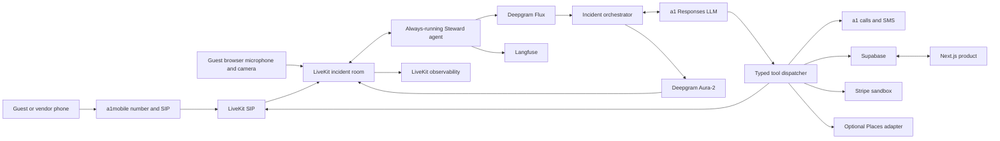
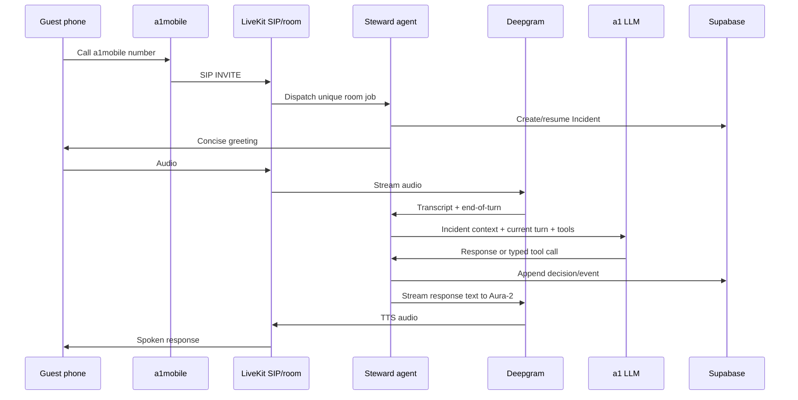
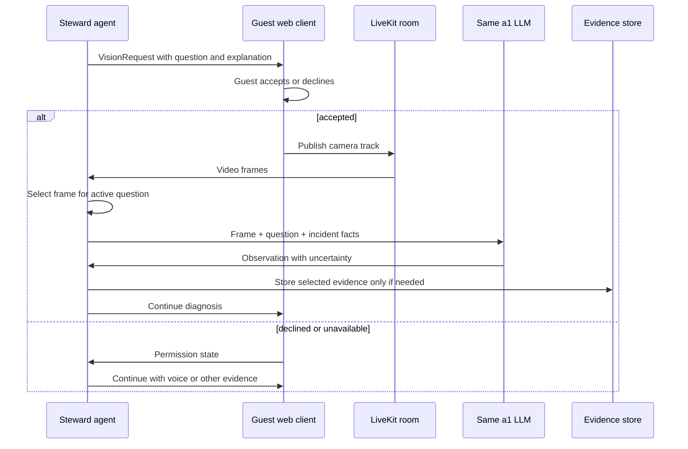

# Design Document

## Overview

Steward is designed as a voice-first incident-resolution system with a supporting web product. The main runtime is an always-running LiveKit agent that receives a1mobile SIP calls, streams audio through Deepgram Flux and Aura-2, uses one a1mobile-hosted OpenAI Responses model for reasoning and vision, and invokes typed tools against Supabase, a1mobile, LiveKit, Stripe sandbox, and an optional vendor directory.

The web product has four surfaces:

1. A visually ambitious, three-dimensional public landing page.
2. A permanent Owner workspace.
3. A permanent Vendor workspace.
4. A temporary, mobile-first Guest incident surface.

The repository uses a contract-first TypeScript monorepo so the voice agent, web application, background jobs, and two parallel builders share one set of runtime-validated messages. Person 1 creates and freezes those contracts before the implementation split. Person 2 builds a small, isolated visual slice against contract fixtures. Person 1 owns live integration and consolidation.

## Design principles

1. **Voice before dashboard.** Optimize the call loop first; web surfaces expose context and proof.
2. **Dynamic reasoning, typed execution.** The LLM chooses actions from real context, while every external action crosses a validated contract.
3. **One incident, many participants.** Guest, vendor, owner, calls, media, tools, and payments attach to one durable Incident identifier.
4. **Evidence before claims.** A successful sentence is downstream of an authoritative result, never a substitute for it.
5. **One model, clear provider boundaries.** Do not hide duplicate LLMs or provider-specific shapes inside the product.
6. **Contracts before branches.** Parallel speed comes from stable interfaces, not duplicated implementation.
7. **Spatial brand, restrained operations.** The landing page earns expressive 3D; task surfaces remain concise and familiar.

## Technology stack

| Layer | Choice | Responsibility |
|---|---|---|
| Language | TypeScript on Node.js | Shared types, agent, server, web, and tests |
| Workspace | pnpm workspaces | Lightweight monorepo without an additional build orchestrator |
| Web | Next.js App Router + React | Landing, authentication, Owner, Vendor, and Guest surfaces |
| Runtime validation | Zod | Shared command, event, API, and fixture contracts |
| Realtime media and SIP | LiveKit Cloud + LiveKit Agents for Node | Rooms, SIP participants, audio/video tracks, agent jobs, call metrics |
| STT | Deepgram Flux | Streaming transcription and conversational turn detection |
| TTS | Deepgram Aura-2 | Streaming human-sounding speech with configurable voice and speed |
| LLM | a1mobile OpenAI-compatible Responses gateway | Conversation, planning, tool calling, scope control, and vision after capability verification |
| Database/Auth/Storage | Supabase | Postgres, email OTP, RLS, Realtime, and evidence objects |
| Payments | Stripe sandbox | Verifiable test-mode vendor payment side effects and webhooks |
| LLM/tool observability | Langfuse | Incident traces, decisions, tool spans, errors, and evaluations |
| 3D | Three.js through React Three Fiber and Drei | Landing-page spatial experience |
| UI motion | Motion for React and R3F render-loop animation | State transitions and purposeful visual response |
| Testing | Vitest + Playwright + axe | Unit, contract, integration, browser, accessibility, and demo checks |

No Pipecat, VoiceOS, computer use, browser automation in the product, or second LLM is part of the hackathon architecture.

## Repository layout

```text
steward/
├── apps/
│   ├── web/                     # Next.js application and server endpoints
│   └── agent/                   # Always-running LiveKit agent worker
├── packages/
│   ├── contracts/               # Person 1-owned Zod schemas and fixtures
│   ├── config/                  # Typed environment validation
│   ├── db/                      # Supabase repositories and generated database types
│   ├── providers/               # a1, LiveKit, Deepgram, Stripe, search adapters
│   ├── observability/           # Correlation, redaction, Langfuse, structured logging
│   └── ui/                      # Tokens and shared accessible primitives
├── supabase/
│   ├── migrations/
│   └── seed.sql
├── infra/
│   └── livekit/                 # Trunk and dispatch configuration templates
├── specs/steward/
│   ├── requirements.md
│   ├── design.md
│   └── tasks.md
├── PRODUCT.md
├── .env.example
└── pnpm-workspace.yaml
```

Person 2 may edit only the agreed web routes, 3D assets, and presentation components during parallel work. Person 2 consumes `packages/contracts`, `packages/config`, and `packages/ui` but does not redefine them.

## High-level architecture



## Shared contracts

### Ownership and freeze rule

Person 1 owns `packages/contracts`. Before branches split, Person 1 must:

1. Define the schemas below.
2. Export TypeScript types inferred from those schemas.
3. Add version fields where messages cross processes or persistent queues.
4. Add valid, boundary, and invalid fixtures.
5. Run contract tests.
6. Commit and push the contract baseline.

Person 2 branches from that exact commit. If a contract must change, Person 1 changes it centrally, runs compatibility tests, and provides a new contract commit to merge or rebase.

### Tool result envelope

Every external action returns one envelope:

```ts
type ToolResult<T> = {
  version: 1;
  incidentId: string;
  operationId: string;
  provider: "a1mobile" | "livekit" | "supabase" | "stripe" | "google-places";
  operation: string;
  status: "success" | "partial" | "failure" | "timeout" | "canceled" | "unknown";
  startedAt: string;
  completedAt: string;
  data?: T;
  error?: {
    code: string;
    safeMessage: string;
    retryable: boolean;
  };
  evidenceRefs: string[];
};
```

Provider payloads never flow directly into the LLM or UI. An adapter normalizes them into this envelope first.

### Actor claim

```ts
type ActorClaim =
  | { kind: "owner"; identityId: string; ownerId: string }
  | { kind: "vendor"; identityId: string; vendorId: string }
  | {
      kind: "guest";
      identityId: string;
      guestSessionId: string;
      bookingId: string | null;
      demo: boolean;
      expiresAt: string;
    };
```

### Incident snapshot

```ts
type IncidentSnapshot = {
  version: 1;
  id: string;
  propertyId: string;
  bookingId: string | null;
  guestSessionId: string;
  goal: string;
  state:
    | "reported"
    | "triaging"
    | "diagnosing"
    | "sourcing"
    | "vendor-contacting"
    | "scheduled"
    | "verification-pending"
    | "resolved"
    | "failed"
    | "escalated";
  risk: "unknown" | "low" | "medium" | "high" | "emergency";
  budget: { currency: string; authorizedMinor: number; spentMinor: number };
  activeHypotheses: Array<{ label: string; confidence: number; evidenceRefs: string[] }>;
  pendingOperations: string[];
  selectedVendorId: string | null;
  outcome: VerifiedOutcome | null;
  updatedAt: string;
};
```

### Incident event

`IncidentEvent` is a discriminated union covering:

- `incident.created`
- `voice.turn.received`
- `voice.response.started`
- `voice.interrupted`
- `incident.goal.updated`
- `incident.hypothesis.updated`
- `tool.started`
- `tool.completed`
- `vision.requested`
- `vision.permission.updated`
- `evidence.recorded`
- `vendor.call.started`
- `vendor.quote.recorded`
- `vendor.selected`
- `payment.started`
- `payment.updated`
- `incident.state.changed`
- `incident.resolved`
- `incident.escalated`

Every event contains `version`, `incidentId`, `eventId`, `occurredAt`, `actor`, and an event-specific payload.

### Vision request

```ts
type VisionRequest = {
  version: 1;
  id: string;
  incidentId: string;
  question: string;
  explanation: string;
  requestedEvidence: "live-camera" | "photo";
  status: "pending" | "accepted" | "declined" | "failed" | "completed";
  createdAt: string;
  expiresAt: string;
};
```

The request describes the diagnostic question, not an expected object. “Show me the keypad display” is acceptable only after the caller establishes that a keypad is relevant; “show me what you are looking at” is safer when the object is unknown.

### Voice status event

```ts
type VoiceStatusEvent = {
  version: 1;
  incidentId: string;
  state:
    | "listening"
    | "thinking"
    | "speaking"
    | "tool-pending"
    | "camera-requested"
    | "disconnected"
    | "ended";
  operationId?: string;
  safeLabel?: string;
  occurredAt: string;
};
```

Person 2 uses this contract to build the Guest conversation surface with fixtures before the live agent exists.

### Vendor quote

```ts
type VendorQuote = {
  version: 1;
  incidentId: string;
  vendorId: string;
  sourceCallId: string;
  currency: string;
  amountMinor: number | null;
  availability: "available" | "unavailable" | "unknown";
  arrivalWindow: { startsAt: string; endsAt: string } | null;
  scope: string | null;
  conditions: string[];
  guarantee: string | null;
  unresolvedFields: string[];
  evidenceRefs: string[];
};
```

Unresolved fields stay unresolved; the extractor never fills them from assumptions.

### Verified outcome

```ts
type VerifiedOutcome = {
  summary: string;
  resolutionType: "troubleshot" | "vendor" | "compensation" | "alternative" | "escalated";
  evidenceRefs: string[];
  verifiedAt: string;
  verifiedBy: "guest" | "vendor" | "agent-vision" | "tool" | "owner";
};
```

## Runtime flows

### Inbound call



The greeting may be stable brand language, but no incident diagnosis or outcome is preselected.

### Voice turn controller

The agent maintains a per-room `TurnController`:

1. Flux emits interim transcript and conversational end-of-turn signals.
2. On early end-of-turn confidence, the agent may start model generation but does not play audio until the turn is sufficiently confirmed.
3. On confirmed end-of-turn, the agent streams model output to Aura-2.
4. When caller speech begins during playback, the controller truncates or cancels TTS, records `voice.interrupted`, and retains the transcript context.
5. Tool calls may continue after interruption when canceling would be unsafe or produce duplicates; their results attach to the Incident independently of the abandoned spoken response.
6. The next model request receives the interruption, any completed tool result, and the still-active Incident_Goal.

### Human speech controller

Human quality is produced by a controller, prompt policy, and evaluation—not by randomly injecting “um.”

The controller uses:

- The current communicative act: acknowledge, clarify, instruct, update, confirm, or close.
- Caller affect and risk level.
- Recently used acknowledgement and filler patterns.
- Whether the next phrase contains critical data.
- Real pending-operation state and elapsed latency.
- Aura-2 punctuation and pacing controls.

Rules:

- Prefer silence or a short acknowledgement for fast operations.
- Use optional, varied disfluency only when it fits hesitation or active checking.
- Use a grounded progress sentence when a pending operation exceeds its expected latency budget.
- Never create fake substeps such as “I found the vendor” without a result.
- Never use filler around codes, money, addresses, safety, confirmations, or outcomes.
- Keep most spoken turns to one or two sentences and one question.

`recentSpeechPatterns` is session state, not permanent user profiling. Phrase selection may use weighted variety, but content-bearing updates come from actual operation data.

### Off-topic handling

The same a1 LLM receives:

- `incident.goal`
- `incident.state`
- allowed tool descriptions
- a concise scope policy
- recent caller turns

The model can acknowledge a detour naturally, but a deterministic post-check rejects unrelated tool calls and long unrelated outputs while the incident remains unresolved. A rejected response is regenerated with an explicit redirect instruction. No separate classifier model is used.

### Tool orchestration and latency speech

Every tool implements:

```ts
interface StewardTool<TInput, TOutput> {
  name: string;
  purpose: string;
  expectedLatency: { typicalMs: number; longMs: number };
  execute(input: TInput, context: ToolContext): Promise<ToolResult<TOutput>>;
}
```

When a call begins, `tool.started` is persisted before the provider request. The Human_Speech_Controller can observe `operationId`, purpose, actual elapsed time, and whether partial provider state exists. Expected latency seeds come from configuration and are replaced by rolling observed percentiles when sufficient samples exist.

Tool idempotency rules:

- SMS: client-generated operation ID stored before sending.
- Outbound call: one operation ID per vendor attempt.
- Stripe: Stripe idempotency key derived from incident, vendor, amount, and payment purpose.
- Guest link: one active token per booking unless explicitly rotated.
- Incident closure: compare-and-set from a nonterminal state with required evidence.

### Vision flow



The raw live stream is not stored by default. Selected frames become Evidence_Records only when required for the Incident or demo proof. Frame prompts ask open questions and require explicit uncertainty. The provisioning test must prove the a1 gateway accepts images before this path is enabled.

### Vendor sourcing and parallel calls

1. Query Approved_Vendors for the inferred service need and property.
2. Filter by policy, service area, and Controlled_Contact status.
3. Start up to `MAX_PARALLEL_VENDOR_CALLS` separate Vendor_Call_Sessions.
4. Give each vendor-call agent only the minimum incident facts, objectives, budget disclosure policy, and structured `VendorQuote` output schema.
5. Parse actual call transcripts into `VendorQuote`; unresolved data remains null and is listed.
6. Join completed or failed call results at the incident coordinator.
7. If no approved option is viable, optionally search Places, while preserving the hackathon restriction against unverified outreach.
8. Rank viable options using safety, arrival time, total price, scope fit, guarantee, and guest impact.
9. Persist the selected option and rationale before booking or payment.

Parallel vendor calls never share a room. The incident coordinator is the only component that compares their results.

### Payment and closure

The hackathon payment adapter creates a real Stripe sandbox object representing the vendor payment obligation. It includes incident and vendor metadata and waits for an authoritative API result or verified webhook.

Payment flow:

1. Validate budget, vendor, quote, amount, currency, and evidence prerequisites.
2. Persist `payment.started` with an idempotency key.
3. Create the Stripe sandbox payment object.
4. Persist immediate provider status.
5. Verify the webhook signature and update the final status.
6. Speak or message success only after authoritative confirmation.

Incident closure is separate. A successful payment does not prove the property problem was resolved, and a Verified_Outcome does not imply payment succeeded.

## Web application design

### Information architecture

```text
Public
├── Landing
├── Sign in
└── Guest link entry

Owner workspace
├── Active incidents
├── Incident detail and timeline
├── Properties
├── Approved vendors
├── Budgets and policies
└── Outcomes and spending

Vendor workspace
├── Available/assigned jobs
├── Job detail
├── Quote and availability
├── Evidence submission
└── Payment status

Guest session
├── Incident conversation
├── Current instruction/action
├── Camera request and preview
└── Resolution status
```

### Landing page spatial concept

The landing page presents one interactive property model, not a gallery of feature cards. The model is an architectural cutaway or abstracted dwelling whose state changes as the visitor moves through the page:

- A guest signal reaches the property.
- Steward's presence appears as coordinated light, motion, or spatial focus.
- Vendor and tool activity become distinct, traceable paths.
- The final state shows evidence and a closed loop, not a celebratory unsupported claim.

The sequence is illustrative, not an incident diagnosis. Labels and short copy explain the system without implying the same steps happen for every problem.

Three.js is accessed through React Three Fiber. Drei supplies camera and asset helpers. Assets use compressed glTF with Draco or Meshopt and compressed textures where practical. The 3D bundle is dynamically imported after essential content becomes interactive.

### Color system

The brand seed is harbor blue near hue 230. The landing uses a committed dark spatial palette; authenticated workspaces use a restrained light operational palette.

Initial OKLCH tokens:

```css
:root {
  --color-bg: oklch(1 0 0);
  --color-surface: oklch(0.97 0.008 230);
  --color-ink: oklch(0.17 0.02 230);
  --color-muted: oklch(0.48 0.025 230);
  --color-primary: oklch(0.55 0.105 230);
  --color-primary-strong: oklch(0.44 0.12 230);
  --color-signal: oklch(0.78 0.14 78);
  --color-success: oklch(0.58 0.13 150);
  --color-warning: oklch(0.72 0.15 78);
  --color-danger: oklch(0.58 0.18 28);
}

.landing-theme {
  --color-bg: oklch(0.08 0 0);
  --color-surface: oklch(0.14 0.012 230);
  --color-ink: oklch(0.96 0.012 230);
  --color-muted: oklch(0.71 0.025 230);
  --color-primary: oklch(0.69 0.13 230);
  --color-primary-strong: oklch(0.76 0.12 230);
  --color-signal: oklch(0.80 0.14 78);
}
```

These are starting tokens. Implementation must measure contrast in the actual component states before freezing them. Saturated primary and signal fills use near-white text unless a verified pale-fill variant is used.

### Typography and layout

- Use one high-quality humanist or neo-grotesk sans family across product surfaces.
- Keep product type on a fixed, compact scale.
- Use a larger but bounded display treatment only on the landing page.
- Limit landing copy to one headline, one short explanatory sentence, one primary action, and sparse labels tied to the 3D story.
- Avoid cards where a timeline, split view, table, list, or spatial relationship communicates better.
- Owner incident detail uses a clear main timeline with secondary evidence and cost panels, not nested dashboards.
- Guest conversation uses a single visual column with persistent connection/action state and an inline camera request.

### Motion

- Product UI transitions generally run 150–250 milliseconds and communicate state.
- The 3D scene may use longer scroll-linked camera movement, but user input always overrides passive choreography.
- No page-load reveal may hide content by default.
- `prefers-reduced-motion` replaces scroll-bound camera movement with stable viewpoints and crossfades.
- Camera, call, tool, and payment motion reflects actual contract state.
- Do not animate fake progress.

### Key UI states

#### Guest surface

- Link validating
- Email verification required
- Demo session creation
- Connecting to room
- Listening
- Agent thinking
- Agent speaking
- Tool pending with safe label
- Vision requested
- Camera permission denied
- Camera unavailable
- Camera connected
- Reconnecting
- Incident resolved
- Incident incomplete or escalated
- Link expired or revoked

#### Owner incident surface

- No active incidents
- Live incident
- Awaiting guest information
- Sourcing vendors
- Multiple quote results
- Payment pending, succeeded, or failed
- Verification pending
- Resolved with evidence
- Failed or escalated with preserved partial results

#### Vendor surface

- No available jobs
- New controlled job
- Quote requested
- Call outcome recorded
- Job accepted
- Evidence required
- Payment pending, succeeded, or failed

## Server interfaces

The exact route implementation may change, but these behavior contracts remain stable:

### Guest access

- `POST /api/guest/demo-session` creates a Demo_Guest_Session only when the feature flag is enabled and the email session is verified.
- `POST /api/guest-links/verify` validates a Guest_Link against hash, booking, verified email, revocation, and expiry.
- `POST /api/livekit/token` issues a short-lived room-scoped token from an authorized ActorClaim.

### Incidents

- `POST /api/incidents` creates an Incident from an authorized guest report or Owner action.
- `GET /api/incidents/:id` returns a role-filtered Incident snapshot.
- `GET /api/incidents/:id/events` returns a role-filtered Incident_Timeline.
- `POST /api/incidents/:id/vision-response` records accept, decline, or failure for a Vision_Request.

### Stripe

- `POST /api/webhooks/stripe` verifies raw-body signatures, persists idempotently, and returns quickly before background processing.

Browser clients never receive LiveKit API secrets, the Supabase secret key, Stripe secret key, a1mobile key, Deepgram key, SIP password, or Langfuse secret.

## Data model

### Core tables

#### `identities` and Supabase Auth

Application profile keyed to the Supabase Auth user ID.

#### `role_memberships`

- `identity_id`
- `role`: `owner | vendor`
- `owner_id` nullable
- `vendor_id` nullable
- unique constraint preventing duplicate membership

#### `owners`

- `id`
- display name
- default currency
- created and updated timestamps

#### `vendors`

- `id`
- name
- service categories
- phone and email
- Controlled_Contact status
- active status
- performance aggregates

#### `properties`

- `id`
- `owner_id`
- name and address fields
- timezone
- access and operational policy references
- active status

#### `bookings`

- `id`
- `property_id`
- external source and external ID nullable
- guest email normalized
- check-in and checkout timestamps
- demo flag

#### `guest_links`

- `id`
- `booking_id`
- SHA-256 token hash, never raw token
- expiration timestamp
- revoked timestamp nullable
- created timestamp

#### `guest_sessions`

- `id`
- `booking_id` nullable for controlled demo seed
- verified identity ID
- demo flag
- expiration timestamp

#### `approved_vendors`

- property ID
- vendor ID
- service category
- priority
- policy notes

#### `incidents`

- IDs for property, booking, guest session
- goal
- state and risk
- budget and spent amount
- selected vendor nullable
- outcome summary and verification timestamp nullable
- correlation ID
- optimistic concurrency version

#### `incident_events`

- incident ID
- event ID unique
- event type
- actor type and actor ID
- validated JSON payload
- occurred timestamp
- hash or sequence for stable ordering

#### `tool_operations`

- operation ID
- incident ID
- provider and operation
- status
- redacted request summary
- normalized result
- start and completion timestamps
- idempotency key nullable

#### `vendor_calls` and `vendor_quotes`

Store room, SIP participant, call outcome, transcript reference, structured quote, unresolved fields, and evidence references.

#### `vision_requests` and `evidence_records`

Store diagnostic question, permission outcome, object reference, provenance, submitter, timestamp, and verification role. Raw continuous video is not stored.

#### `payments`

Store incident, vendor, amount, currency, Stripe object ID, idempotency key, provider status, verified webhook timestamp, and failure code.

### Row Level Security

- Owners access rows through property ownership or explicit delegation.
- Vendors access jobs, communications, evidence, and payment rows assigned to their vendor ID.
- Guests access only the guest session and incident authorized by the current verified identity and unexpired session.
- The agent and webhook server use a backend secret key after performing explicit application authorization.
- Public anonymous access is denied for operational tables.

## Provider adapters

### `TelephonyProvider`

- Create outbound vendor call
- Read call status
- Hang up
- Send DTMF if needed
- Normalize SIP failures

### `MessagingProvider`

- Send a1mobile confirmation SMS
- Return provider message reference and honest delivery knowledge

### `ReasoningProvider`

- Stream a Responses request
- Attach typed tools
- Send image input when capability is enabled
- Normalize model usage and error states

### `SpeechProvider`

- Start Flux transcription
- Consume turn events
- Stream Aura-2 TTS
- Cancel playback on interruption

### `VendorDirectory`

- Query Approved_Vendors first from Supabase
- Optionally query Places only after approved options fail
- Never turn a search result into a Controlled_Contact automatically

### `PaymentProvider`

- Create sandbox payment with idempotency
- Fetch payment status
- Verify Stripe webhook event

### `EvidenceStore`

- Store selected evidence object
- Create provenance record
- Issue authorized signed read URL

## Observability design

One `incidentId` and `correlationId` propagate through:

- LiveKit room metadata
- Agent job metadata
- Langfuse session and traces
- Supabase Incident and operation rows
- a1mobile message metadata where supported
- Vendor call records
- Stripe metadata
- Structured application logs

### Trace spans

- `voice.turn`
- `stt.finalize`
- `llm.response`
- `scope.check`
- `tool.<name>`
- `tts.first_audio`
- `vendor.call`
- `vision.sample`
- `payment.verify`
- `incident.close`

Redaction removes team keys, API keys, SIP passwords, full access codes, full payment data, and unnecessary guest identifiers before remote logs. Operational records may retain protected values in the authorized database when the product requires them.

## Error handling

| Failure | Required behavior |
|---|---|
| Agent worker unavailable | Fail honestly; preflight prevents judging with an unregistered worker |
| a1 inbound SIP failure | Record routing failure and use organizer-supported recovery, not a fake answered call |
| Outbound not enabled | Disable outbound action, explain the provisioning blocker, preserve vendor selection |
| Flux disconnect | Reconnect once when safe; ask for repetition after recovery |
| Aura-2 failure | Stop claiming to speak; retry or surface call failure honestly |
| LLM timeout | Preserve transcript and incident, give a brief recovery message, retry within policy |
| Image input unsupported | Disable Vision_Request until the single reasoning provider is replaced or verified |
| Camera denied | Continue voice-only and record denial without pressure |
| Tool timeout | Return typed timeout, provide grounded wait/failure speech, replan |
| Vendor no answer | Record no-answer outcome and continue approved sourcing |
| Stripe failure | Do not say paid; preserve agreement and failed payment record |
| Webhook duplication | Apply idempotently and retain one state transition |
| Guest link expired | Deny incident access and offer Owner/contact recovery |
| Supabase unavailable | Keep in-memory call context temporarily, do not claim durable writes, retry or escalate |
| Langfuse unavailable | Continue product flow with local structured logs; monitoring failure does not block resolution |
| 3D load/WebGL failure | Render static landing composition with all content and navigation available |

## Correctness properties

### Property 1: Role union without permission union

An Identity may hold both permanent roles, but selecting one role never grants data permissions belonging only to the other role.

### Property 2: Guest expiry

For any production booking, Guest_Link expiration equals checkout plus fourteen calendar days, and access fails after expiration or revocation.

### Property 3: Demo access isolation

Demo guest creation succeeds only when the feature flag is enabled and creates demo-tagged data that cannot expose a real booking.

### Property 4: Tool result honesty

No successful external-action event exists without a success Tool_Result from the responsible provider adapter.

### Property 5: Resolution evidence

An Incident cannot transition to `resolved` when its Verified_Outcome is null or its evidence reference list is empty.

### Property 6: Payment idempotency

Repeated execution of the same incident/vendor/amount/purpose payment command creates at most one logical Stripe payment.

### Property 7: Approved-vendor precedence

External discovery does not execute until all suitable approved candidates have an observed unavailable, unsuitable, failed, or exhausted state.

### Property 8: Vendor call isolation

Every concurrent vendor call has a different room name and cannot subscribe to another vendor-call room.

### Property 9: Visual non-assumption

Changing an input image from a property object to an unrelated object changes the visual observation; no expected object label is injected as a fact.

### Property 10: Single reasoning model

Every conversation, scope, planning, tool-selection, and enabled image-reasoning request resolves through the same configured ReasoningProvider model identifier.

### Property 11: Camera permission

No browser camera request occurs before an active Vision_Request and explicit Guest acceptance.

### Property 12: Off-topic containment

For an unresolved incident, unrelated requests do not trigger unrelated tools or replace the Incident_Goal.

### Property 13: Interruption preservation

When barge-in occurs, agent playback stops, the interruption turn is stored, and the next response includes the interrupted context.

### Property 14: Critical-speech clarity

Utterances containing access codes, prices, times, addresses, safety instructions, or final status contain no inserted filler token.

### Property 15: Contract compatibility

Both web fixtures and live agent events pass the same Zod schemas; invalid or unknown-version messages fail safely.

### Property 16: Secret boundary

No client bundle or public API response contains a server-only environment variable.

### Property 17: Static landing fallback

Disabling JavaScript WebGL capability or enabling reduced motion preserves the landing page's content, navigation, and primary action.

## Testing strategy

### Contract tests

- Parse every valid fixture.
- Reject missing discriminators, invalid states, negative money, malformed timestamps, unknown contract versions, and mismatched actor claims.
- Run from both the agent and web package dependency graphs.

### Unit and property tests

- Guest-link expiration and revocation.
- Role authorization matrix.
- Incident state and closure guards.
- Budget arithmetic and payment idempotency.
- Approved-vendor precedence.
- Vendor ranking with missing quote fields.
- Speech controller repetition and critical-data exclusions.
- Scope post-check behavior.
- Tool result normalization.

### Provider smoke tests

- a1 number claim or existing assignment.
- a1 unrelated-image vision test.
- a1 SMS to verified test number.
- LiveKit inbound call.
- LiveKit outbound call to controlled line.
- Deepgram Flux and Aura-2 streaming.
- Supabase Auth, RLS, Realtime, and storage.
- Stripe sandbox event plus verified webhook.
- Langfuse trace ingestion.

### Voice evaluation

Use recordings, not text review alone. The evaluation matrix includes:

- Clear report
- Mumbling and self-correction
- Barge-in during greeting, instruction, and tool wait
- Donkey/trivia/recipe detour
- Angry and anxious caller
- Long silence and incomplete sentence
- Slow successful tool
- Timed-out tool
- Contradictory evidence
- Repeated caller question
- Access code and payment readback

Score task focus, interruption behavior, repetition, latency, prosody, truthfulness, and resolution quality.

### Vision evaluation

- Relevant property object
- Unrelated fruit or toy
- Dark frame
- Blurry frame
- Multiple objects
- Camera refusal
- Camera disconnect
- New frame contradicting the prior hypothesis

### Browser and visual tests

- Mobile Guest surface from 320px upward.
- Owner and Vendor surfaces at desktop and 200% zoom.
- Keyboard-only flow.
- axe checks on functional routes.
- Reduced motion.
- WebGL disabled/static fallback.
- 3D loading and interaction performance on a mid-range laptop and phone.
- Visual regression for role, call, camera, payment, and error states.

### End-to-end demo test

1. Judge enters a Demo_Guest_Session or calls the a1 number.
2. Judge reports an arbitrary incident.
3. Judge interrupts and introduces an off-topic detour.
4. Steward redirects naturally and continues.
5. Steward requests camera only if useful; the judge may show an unrelated object.
6. Steward performs real troubleshooting or a controlled vendor flow.
7. At least one planted option or tool fails.
8. Steward replans.
9. A verifiable a1 SMS, controlled call, or Stripe sandbox action occurs.
10. The Owner workspace shows the actual timeline, failures, evidence, cost, and final verified or honestly incomplete outcome.

## Parallel development boundary

### Person 1 owns

- All specifications and Shared_Contracts
- Monorepo and environment validation
- Supabase schema, authentication, and RLS
- a1mobile and LiveKit provisioning
- LiveKit agent, Deepgram, LLM, voice behavior, and vision reasoning
- Incident orchestration, vendors, payments, and observability
- Owner and Vendor operational integration
- Final branch consolidation and end-to-end demo

### Person 2 owns after contract freeze

Only three independent deliverables:

1. Shared-token-driven visual foundation and the 3D landing page.
2. Guest temporary-access and live-incident UI against contract fixtures.
3. Responsive, reduced-motion, accessibility, and visual-state tests for those surfaces.

Person 2 does not implement provider SDKs, agent logic, database policies, tool execution, or Shared_Contract changes. The branch must be demonstrable with fixtures even if the core agent is not running.

### Consolidation

Person 1 merges Person 2's branch only after its independent checks pass, replaces fixture adapters with live endpoints, resolves integration differences centrally, runs the full provider preflight and demo path, and creates the release commit.
